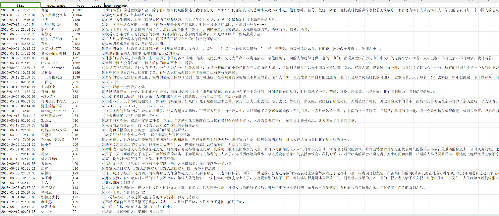
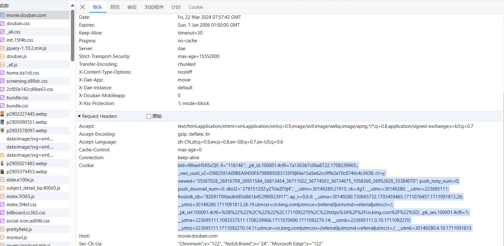

# 项目介绍
闲来无事，想通过大模型对豆瓣中评论进行舆情分析，所以研究了下爬虫。

对豆瓣短评进行爬取，包括豆瓣读书，豆瓣电影和豆瓣音乐。
爬取结果展示：

[【书】活着](./result/[book]活着.xlsx)



> 项目局限性：由于豆瓣的反爬机制，最多获取600条评论，如果是图书和音乐则会更少。

## 其他内容

由于刚刚接触爬虫，采用不同方法尝试对网页内容进行爬取，爬取结果保存在result中。
### 采用selenium的方式
`bilili_auto.py': 用于爬取b站热门视频，修改变量`target_count`可设置爬取数目。

运行过程：

结果：

[2024-03-19热门视频](./result/bili_hot_video_2024-03-19_13-56-19.xlsx)

[2024-03-22热门视频](./result/bili_hot_video_2024-03-22_15-29-39.xlsx)

### 采用requests的方式
`book_douban250.py`: 用于爬取豆瓣读书250。
[豆瓣250](./result/douban_books_top250.xlsx)

# 环境

python3应该都可以，本人采用python3.12.5

```shell
cd src
```

```shell
pip install -r requirements.txt
```

# 运行

获取豆瓣读书，豆瓣音乐，豆瓣电影的核心类在`moudle/BriefCommentDouban.py`。

运行文件为`douban.py`，配置文件为`doubanConfig.yaml`

## 获得cookie

由于豆瓣设置了评论数目的权限，非登入用户仅能获得220条，登入用户限制图书最多能获取300条评论，电影能获取600条评论，音乐是500条。

获取豆瓣网（Douban）的cookie通常涉及到在你的浏览器中登录豆瓣网，并从浏览器的开发者工具中提取cookie。这里是一个详细的步骤说明：

**步骤 1: 登录豆瓣网**

1. 打开你的浏览器（例如Chrome、Firefox或Edge）。
2. 访问豆瓣网的登录页面（通常是 https://www.douban.com/）。
3. 输入你的登录信息（电子邮件和密码）并登录到你的账户。

**步骤 2: 打开浏览器的开发者工具**

在大多数现代浏览器中，你可以通过以下任一方法打开开发者工具：

- 右击网页，然后选择“检查”（Inspect）或“检查元素”（Inspect Element）或“F12”。
- 使用快捷键，例如Chrome和Firefox中的`Ctrl+Shift+I`（Windows/Linux）或`Cmd+Opt+I`（Mac）。
- 通过浏览器菜单，例如在Chrome中，可以选择菜单中的“更多工具”（More Tools）> “开发者工具”（Developer Tools）。

**步骤 3: 查找和提取Cookie**

1. 在开发者工具中，切换到“网络”（Network）标签页。
2. 刷新豆瓣网页面以捕获网络请求。
3. 在“网络”（Network）面板中，找到任何一个发送到豆瓣网的请求。这可以是页面的主要请求（通常是一个HTML文件），也可以是静态文件或API请求。
4. 点击这个请求，然后查看请求的详细信息。在详情面板中，切换到“请求头”（Request Headers）或“Cookie”部分。
5. 在“Cookie”部分，你会看到当前页面请求所使用的所有cookie。这通常是一长串键值对，形如`key=value; anotherkey=anothervalue; ...`。
6. 复制整个cookie字符串。



## 解析cookie到配置文件

```shell
python douban.py --cookie '您复制的cookie字符串'
```

测试：

```bash
python douban.py --cookie 'bid=lWwxH5R5cQY; ll="118146"; _pk_id.100001.4cf6=7a1363b7c06a8722.1708239965.; _vwo_uuid_v2=D982591A09BEA9450F679BBB9283135FB|66e15a5e62cc9ffe2e70c874
6c4c3438; ct=y; viewed="35587028_26916709_26951584_36813454_36711022_36774503_36734675_1058360_26952828_35384070"; push_noty_num=0; push_doumail_num=0; dbcl2="279151202:yZTcleZF0j4"; __utmv=30149280.27915; __utmz=223695111.1710987234.10.10.utmc
sr=douban.com|utmccn=(referral)|utmcmd=referral|utmcct=/misc/sorry; __utmz=30149280.1711011072.23.18.utmcsr=music.douban.com|utmccn=(referral)|utmcmd=referral|utmcct=/subject/36770176/comments/; ck=JIgT; _pk_ref.100001.4cf6=%5B%22%22%2C%22%22%2
C1711070689%2C%22https%3A%2F%2Fwww.douban.com%2Fmisc%2Fsorry%3Foriginal-url%3Dhttps%3A%2F%2Fmovie.douban.com%2F%22%5D; _pk_ses.100001.4cf6=1; ap_v=0,6.0; __utma=30149280.730665732.1705459465.1711011072.1711070690.24; __utmb=30149280.0.10.1711070690; __utmc=30149280; __utma=223695111.1083537511.1708239966.1711005297.1711070690.13; __utmb=223695111.0.10.1711070690; __utmc=223695111; frodotk_db="8209170fdadb685d861b452f90923917"'
Cookie updated successfully.
```

`doubanConfig.yaml`生成的Cookie：

```shell
cookies:
  __utma: 223695111.1083537511.1708239966.1711005297.1711070690.13
  __utmb: 223695111.0.10.1711070690
  __utmc: '223695111'
  __utmv: '30149280.27915'
  __utmz: 30149280.1711011072.23.18.utmcsr=music.douban.com|utmccn=(referral)|utmcmd=referral|utmcct=/subject/36770176/comments/
  _pk_id.100001.4cf6: 7a1363b7c06a8722.1708239965.
  _pk_ref.100001.4cf6: '%5B%22%22%2C%22%22%2C1711070689%2C%22https%3A%2F%2Fwww.douban.com%2Fmisc%2Fsorry%3Foriginal-url%3Dhttps%3A%2F%2Fmovie.douban.com%2F%22%5D'
  _pk_ses.100001.4cf6: '1'
  _vwo_uuid_v2: D982591A09BEA9450F679BBB9283135FB|66e15a5e62cc9ffe2e70c8746c4c3438
  ap_v: 0,6.0
  bid: lWwxH5R5cQY
  ck: JIgT
  ct: y
  dbcl2: 279151202:yZTcleZF0j4
  frodotk_db: 8209170fdadb685d861b452f90923917
  ll: '118146'
  push_doumail_num: '0'
  push_noty_num: '0'
  viewed: '35587028_26916709_26951584_36813454_36711022_36774503_36734675_1058360_26952828_35384070'
```

## 修改配置文件

打开`doubanConfig.yaml`：

```shell
browser:
  browser_type: Edge
  headless: true
cookies:
	……………………………………………………略……………………………………………………
```

`browser_type`:设置浏览器，从Chrome, Edge, Firefox和Safari中选择一个，注意首字母大写。

`headless`：true：不显示浏览器，false：显示浏览器。

## 爬取评论

### 通过类别和名称爬取

格式如下：

```shell
python douban.py --c '{类别}' --name '{名称}'
```

对于类别采用了正则匹配：

```shell
BOOK = r'^[Bb]'
MUSIC = r'^[Mm][Uu]'
MOVIE = r'^[Mm][Oo]'
```

图书：以b开头，不限制大小写；

音乐：以mu开头，不限制大小写；

电影：以mv开头，不限制大小写；

例如：

**图书**

```bash
python .\douban.py --c 'b' --name '献给阿尔吉侬的花束'
```

```bash
Received name: 献给阿尔吉侬的花束

DevTools listening on ws://127.0.0.1:10840/devtools/browser/951959d7-ed09-420a-8c0b-030340808b31
[0322/151613.099:INFO:CONSOLE(2)] "鍠滄鐪嬭眴鐡ｇ殑浠ｇ爜锛岃繕鏄彂鐜颁簡浠€涔坆ug锛熶笉濡傚拰鎴戜滑涓€璧蜂负璞嗙摚娣荤爾鍔犵摝鍚э紒
http://jobs.douban.com/#position-zsqd", source: https://img1.doubanio.com/f/shire/4888ee2fda6812f70a064a51c93b84fde8e4a3c2/js/douban.js (2)
[0322/151613.246:INFO:CONSOLE(0)] "Refused to execute script from 'https://search.douban.com/js/core/new_rating.js' because its MIME type ('') is not executable, and strict MIME type checking is enabled.", source: https://search.douban.com/book/subject_search?search_text=%E7%8C%AE%E7%BB%99%E9%98%BF%E5%B0%94%E5%90%89%E4%BE%AC%E7%9A%84%E8%8A%B1%E6%9D%9F (0)
[0322/151614.507:INFO:CONSOLE(0)] "Third-party cookie will be blocked. Learn more in the Issues tab.", source: https://search.douban.com/book/subject_search?search_text=%E7%8C%AE%E7%BB%99%E9%98%BF%E5%B0%94%E5%90%89%E4%BE%AC%E7%9A%84%E8%8A%B1%E6%9D%9F (0)
[0322/151614.731:INFO:CONSOLE(0)] "Third-party cookie will be blocked. Learn more in the Issues tab.", source: https://search.douban.com/book/subject_search?search_text=%E7%8C%AE%E7%BB%99%E9%98%BF%E5%B0%94%E5%90%89%E4%BE%AC%E7%9A%84%E8%8A%B1%E6%9D%9F (0)
[0322/151614.822:INFO:CONSOLE(0)] "Third-party cookie will be blocked. Learn more in the Issues tab.", source: https://search.douban.com/book/subject_search?search_text=%E7%8C%AE%E7%BB%99%E9%98%BF%E5%B0%94%E5%90%89%E4%BE%AC%E7%9A%84%E8%8A%B1%E6%9D%9F (0)
[0322/151615.135:INFO:CONSOLE(0)] "Third-party cookie will be blocked. Learn more in the Issues tab.", source: https://search.douban.com/book/subject_search?search_text=%E7%8C%AE%E7%BB%99%E9%98%BF%E5%B0%94%E5%90%89%E4%BE%AC%E7%9A%84%E8%8A%B1%E6%9D%9F (0)
[0322/151616.040:INFO:CONSOLE(0)] "Third-party cookie will be blocked. Learn more in the Issues tab.", source: https://search.douban.com/book/subject_search?search_text=%E7%8C%AE%E7%BB%99%E9%98%BF%E5%B0%94%E5%90%89%E4%BE%AC%E7%9A%84%E8%8A%B1%E6%9D%9F (0)
[0322/151616.885:INFO:CONSOLE(0)] "Third-party cookie will be blocked. Learn more in the Issues tab.", source: https://search.douban.com/book/subject_search?search_text=%E7%8C%AE%E7%BB%99%E9%98%BF%E5%B0%94%E5%90%89%E4%BE%AC%E7%9A%84%E8%8A%B1%E6%9D%9F (0)
[0322/151634.785:INFO:CONSOLE(0)] "Third-party cookie will be blocked. Learn more in the Issues tab.", source: https://search.douban.com/book/subject_search?search_text=%E7%8C%AE%E7%BB%99%E9%98%BF%E5%B0%94%E5%90%89%E4%BE%AC%E7%9A%84%E8%8A%B1%E6%9D%9F (0)
[0322/151635.967:INFO:CONSOLE(0)] "Third-party cookie will be blocked. Learn more in the Issues tab.", source: https://search.douban.com/book/subject_search?search_text=%E7%8C%AE%E7%BB%99%E9%98%BF%E5%B0%94%E5%90%89%E4%BE%AC%E7%9A%84%E8%8A%B1%E6%9D%9F (0)
https://book.douban.com/subject/26362836/
https://book.douban.com/subject/26362836/comments?limit=20&start=
一共有41238条评论,豆瓣限制图书最多能获取300条评论，电影能获取600条评论，音乐是500条
处理进度: 100%|████████████████████████████████████████████████████████████████████████████████████████████████████████████████████████████████████████████████████████████████████████████████████████████████████| 15/15 [00:43<00:00,  2.92s/it]
开始保存为Excel
文件保存为： ../result/[book]献给阿尔吉侬的花束.xlsx
```

[【书】献给阿尔吉侬的花束](./result/[book]献给阿尔吉侬的花束.xlsx)

**音乐**

```shell
python .\douban.py --c 'mu' --name '最伟大的作品'
```

```bash
Received name: 最伟大的作品

DevTools listening on ws://127.0.0.1:7111/devtools/browser/827943eb-885c-4b0a-b330-4706deba585f
[0322/112104.037:INFO:CONSOLE(2)] "鍠滄鐪嬭眴鐡ｇ殑浠ｇ爜锛岃繕鏄彂鐜颁簡浠€涔坆ug锛熶笉濡傚拰鎴戜滑涓€璧蜂负璞嗙摚娣荤爾鍔犵摝鍚э紒
http://jobs.douban.com/#position-zsqd", source: https://img1.doubanio.com/f/shire/4888ee2fda6812f70a064a51c93b84fde8e4a3c2/js/douban.js (2)
[0322/112104.179:INFO:CONSOLE(0)] "Refused to execute script from 'https://search.douban.com/js/core/new_rating.js' because its MIME type ('') is not executable, and strict MIME type checking is enabled.", source: https://search.douban.com/music/subject_search?search_text=%E6%9C%80%E4%BC%9F%E5%A4%A7%E7%9A%84%E4%BD%9C%E5%93%81 (0)
[0322/112104.452:INFO:CONSOLE(1)] "[Warning]: dale_music_subject_search_top_right content is empty", source: https://img1.doubanio.com/bG90MDZqMy9mL2FkanMvYzhmZjE5MGNhYzNkN2UyMWJjMTI3NzJlYWNkOWVkODZhMmFjMzdhMi9hZC5yZWxlYXNlLmpz?company_token=kX69T8w1wyOE-dale (1)
https://music.douban.com/subject/35937990/
https://music.douban.com/subject/35937990/comments?limit=20&start=
没有获得评论数目，默认600条
处理进度: 100%|████████████████████████████████████████████████████████████████████████████████████████████████████████████████████████████████████████████████████████████████████████████████████████████████████| 25/25 [01:09<00:00,  2.79s/it] 
开始保存为Excel
文件保存为： ../result/[music]最伟大的作品.xlsx
```

[【音乐】最伟大的作品](./result/[music]最伟大的作品.xlsx)

**电影**:

```bash
python .\douban.py --c 'mo' --name '功夫'
```

```bash
Received name: 功夫

DevTools listening on ws://127.0.0.1:6949/devtools/browser/552f2040-a00a-4abc-a29a-1a025e7dbbe5
[0322/111731.802:INFO:CONSOLE(2)] "鍠滄鐪嬭眴鐡ｇ殑浠ｇ爜锛岃繕鏄彂鐜颁簡浠€涔坆ug锛熶笉濡傚拰鎴戜滑涓€璧蜂负璞嗙摚娣荤爾鍔犵摝鍚э紒
http://jobs.douban.com/#position-zsqd", source: https://img1.doubanio.com/f/shire/4888ee2fda6812f70a064a51c93b84fde8e4a3c2/js/douban.js (2)
[0322/111731.927:INFO:CONSOLE(0)] "Refused to execute script from 'https://search.douban.com/js/core/new_rating.js' because its MIME type ('') is not executable, and strict MIME type checking is enabled.", source: https://search.douban.com/movie/subject_search?search_text=%E5%8A%9F%E5%A4%AB (0)
[0322/111732.922:INFO:CONSOLE(0)] "Third-party cookie will be blocked. Learn more in the Issues tab.", source: https://search.douban.com/movie/subject_search?search_text=%E5%8A%9F%E5%A4%AB (0)
[0322/111733.147:INFO:CONSOLE(0)] "Third-party cookie will be blocked. Learn more in the Issues tab.", source: https://search.douban.com/movie/subject_search?search_text=%E5%8A%9F%E5%A4%AB (0)
[0322/111733.161:INFO:CONSOLE(0)] "Third-party cookie will be blocked. Learn more in the Issues tab.", source: https://search.douban.com/movie/subject_search?search_text=%E5%8A%9F%E5%A4%AB (0)
[0322/111734.566:INFO:CONSOLE(0)] "Third-party cookie will be blocked. Learn more in the Issues tab.", source: https://search.douban.com/movie/subject_search?search_text=%E5%8A%9F%E5%A4%AB (0)
[0322/111735.397:INFO:CONSOLE(0)] "Third-party cookie will be blocked. Learn more in the Issues tab.", source: https://search.douban.com/movie/subject_search?search_text=%E5%8A%9F%E5%A4%AB (0)
[0322/111753.420:INFO:CONSOLE(0)] "Third-party cookie will be blocked. Learn more in the Issues tab.", source: https://search.douban.com/movie/subject_search?search_text=%E5%8A%9F%E5%A4%AB (0)
[0322/111754.483:INFO:CONSOLE(0)] "Third-party cookie will be blocked. Learn more in the Issues tab.", source: https://search.douban.com/movie/subject_search?search_text=%E5%8A%9F%E5%A4%AB (0)
https://movie.douban.com/subject/1291543/
https://movie.douban.com/subject/1291543/comments?limit=120&start=
一共有150170条评论,豆瓣限制图书最多能获取300条评论，电影能获取600条评论，音乐是500条
处理进度: 100%|██████████████████████████████████████████████████████████████████████████████████████████████████████████████████████████████████████████████████████████████████████████████████████████████████████| 5/5 [00:17<00:00,  3.54s/it] 
开始保存为Excel
文件保存为： ../result/[movie]功夫.xlsx
```

[【电影】功夫](./result/[movie]功夫.xlsx)

### 通过链接爬取

链接形式：

```bash
https://movie.douban.com/subject/{一串数字，应该是作品编号}/
```

例如：

https://movie.douban.com/subject/36081094/

界面应为电影首页：


格式如下：

```bas
python douban.py --link {您的链接}
```

```bash
python douban.py --link https://movie.douban.com/subject/36081094/
```

```bash
Received link: https://movie.douban.com/subject/36081094/
https://movie.douban.com/subject/36081094/
https://movie.douban.com/subject/36081094/comments?limit=20&start=
一共有314623条评论,豆瓣限制图书最多能获取300条评论，电影能获取600条评论，音乐是500条
处理进度: 100%|████████████████████████████████████████████████████████████████████████████████████████████████████████████████████████████████████████████████████████████████████████████████████████████████████| 30/30 [01:23<00:00,  2.78s/it]
开始保存为Excel
文件保存为： ../result/2024-03-22_15-27-18.xlsx
```

[2024-03-22 热辣滚烫](./result/2024-03-22_15-27-18.xlsx)

用链接速度更快些，因为免去的解析评论页面地址的过程。